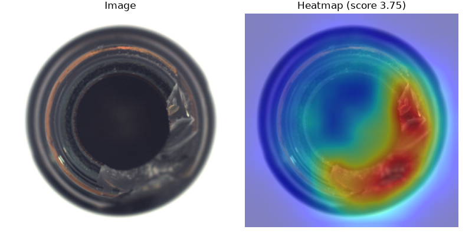
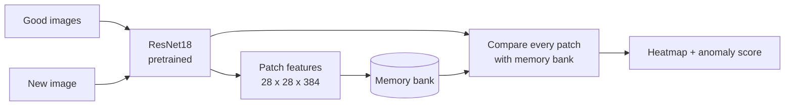

# AI Visual Quality Inspection

Automatic visual defect detection for industrial parts – the model learns **only from good parts**
and then finds and localizes defects it has **never seen before**.



*Left: test image of a broken bottle. Right: anomaly heatmap – red = suspicious area.
The model was trained on defect-free bottles only.*

---

## Why this approach?

In a real factory, defects are **rare** and come in endless variations – collecting thousands of
labelled defect images is usually impossible. But good parts are available in large numbers.

So the model works like a new quality inspector:

1. **Learn** – look at many *good* parts and remember what every small area looks like
2. **Inspect** – for a new part, compare every small area with what it has seen before
3. **Decide** – an area that looks unfamiliar is marked as a possible **defect**

This is called **anomaly detection**. The method here follows the idea of
[PatchCore (Roth et al., 2022)](https://arxiv.org/abs/2106.08265).

## How it works



- **Feature extractor:** ResNet18 pretrained on ImageNet – no training from scratch needed
- **Patch features:** outputs of `layer2` (fine details) and `layer3` (larger context) are combined,
  so every 8 x 8 pixel patch is described by 384 numbers
- **Memory bank:** all patch features of all good training images
- **Anomaly score:** for each patch, the distance to its nearest neighbour in the memory bank.
  The heatmap shows these distances, the image score is the maximum

Everything runs on a normal laptop **CPU** (tested on AMD Ryzen 7 5700U, 16 GB RAM).

## Results

Image-level AUROC on the [MVTec AD](https://www.mvtec.com/company/research/datasets/mvtec-ad) test sets
(100 % = every defective image gets a higher score than every good image):

| Category | Type    | Train images (good) | Test images | Image AUROC |
|----------|---------|--------------------:|------------:|------------:|
| bottle   | object  | 209                 | 83          | **100.0 %** |
| screw    | object  | 320                 | 160         | **97.4 %**  |
| grid     | texture | 264                 | 78          | **85.0 %**  |

**Observations**

- **bottle:** perfect separation – the highest score of a good bottle (1.56) is below the lowest
  score of a defective one (1.95).
- **screw:** one of the hardest MVTec categories (random rotation, tiny defects). Good and defective
  scores overlap slightly, so the decision threshold becomes a trade-off between
  *false alarms* (good parts rejected) and *missed defects*.
- **grid:** fine, repetitive wire texture. Increasing the image size from 224 to 320 px made the
  result **worse** (78.0 %) – the model then also flags normal small variations in the wires.
  A stronger feature extractor (e.g. WideResNet50) is the next experiment.

## Quick start

```bash
# 1. Environment (Python 3.10+)
python -m venv .venv
source .venv/Scripts/activate        # Windows Git Bash  (Linux/macOS: source .venv/bin/activate)
pip install torch torchvision --index-url https://download.pytorch.org/whl/cpu
pip install -r requirements.txt

# 2. Data: download a category (e.g. bottle) from MVTec AD and extract it to data/mvtec_ad/

# 3. Learn from good images
python train.py --category bottle

# 4. Inspect one image -> prints the score, saves heatmap.png
python predict.py data/mvtec_ad/bottle/test/broken_large/000.png --category bottle

# 5. Evaluate on the whole test set -> AUROC
python evaluate.py --category bottle
```

## Run as a service (REST API + Docker)

The model is also available as a small web service built with **FastAPI**:

| Endpoint | Method | What it does |
|----------|--------|--------------|
| `/health`  | GET  | returns `{"status": "ok"}` if the service is running |
| `/predict?category=bottle` | POST | upload an image, get `{"filename", "category", "anomaly_score"}` |
| `/docs`    | GET  | interactive test page (generated automatically by FastAPI) |

**Option A – run locally**

```bash
uvicorn api:app --reload
# then open http://127.0.0.1:8000/docs
```

**Option B – run in Docker** (no local Python setup needed)

```bash
# build the image once (~5 min the first time)
docker build -t ai-inspection .

# run it - the memory banks are mounted from the host (read-only)
docker run --rm -p 8000:8000 -v "$(pwd)/memory_banks:/app/memory_banks:ro" ai-inspection
```

> On Windows Git Bash use: `MSYS_NO_PATHCONV=1 docker run --rm -p 8000:8000 -v "$(pwd -W)/memory_banks:/app/memory_banks:ro" ai-inspection`

Example request with `curl`:

```bash
curl -X POST "http://127.0.0.1:8000/predict?category=bottle" \
     -F "file=@data/mvtec_ad/bottle/test/broken_large/000.png"
# {"filename":"000.png","category":"bottle","anomaly_score":3.75}
```

Design decisions:
- The memory banks (several hundred MB) are **not** baked into the image but mounted as a volume,
  so the image stays smaller and banks can be updated without rebuilding.
- The pretrained ResNet18 weights are downloaded **at build time**, so the container needs no internet at runtime.
- Libraries are installed **before** the code is copied, so code changes rebuild in seconds (Docker layer cache).

## Project structure

```
patchcore.py      the model: feature extraction, memory bank, detection
train.py          build the memory bank for one category
predict.py        inspect one image, save a heatmap
evaluate.py       score all test images, compute the AUROC
api.py            REST API (FastAPI): /health, /predict
Dockerfile        container image for the API
requirements.txt  Python dependencies
```

## Roadmap

- [x] Anomaly detection with heatmaps (PatchCore idea, ResNet18, CPU)
- [x] Evaluation on 3 MVTec AD categories
- [x] REST API (FastAPI) – send an image, get the anomaly score
- [x] Docker image
- [ ] Simple web demo: upload an image, see the result
- [ ] CI with GitHub Actions

## Data & license

The MVTec AD dataset is © MVTec Software GmbH and licensed under
[CC BY-NC-SA 4.0](https://creativecommons.org/licenses/by-nc-sa/4.0/) (non-commercial use only).
It is **not** included in this repository. The example image above is derived from MVTec AD.

> P. Bergmann, M. Fauser, D. Sattlegger, C. Steger: *MVTec AD – A Comprehensive Real-World Dataset
> for Unsupervised Anomaly Detection*, CVPR 2019.

## Author

**Bakir Zanoun** – [bakirzanoun.de](https://bakirzanoun.de)
